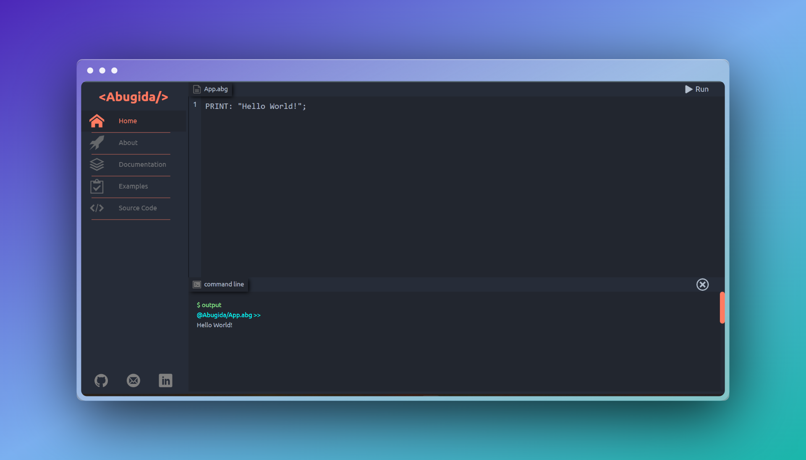

# Abugida(አቡጊዳ)

## 💻 Online Compiler

<br>



## 📝 About

- Abugida is a high-level programming language that helps you learn the basics of programming in simple syntax.
- It supports
  - Basic data types like numbers, strings and lists.
  - Variable declaration and assignment.
  - Arithmetic operations.
  - Conditional statements.
  - Loops.
  - Built-in Functions.
  - Comments.
  - And more...
- It has built-in Lexer, Parser, Interpreter and Abstract Syntax Tree implemented in python with a simple syntax.

## 👏 Acknowledgements

- This project is inspired by Ruslan's ["Let's Build a Simple Interpreter"](https://ruslanspivak.com/lsbasi-part1/) Blog
  
## 🧱 Built With

- 
- 
- 
- 
- 

  
## ⚙️ Installation and setup instructions

1. Clone down this repo. Use Git or checkout with SVN using the web URL <br><br>
   ```sh
   git clone https://github.com/bedre7/abugida.git
   ```
2. Install python dependencies in backend directory<br><br>
   ```sh
   pip install -r requrements.txt
   ```
3. Install npm dependencies in frontend directory<br><br>
   ```sh
   npm install
   ```
4. Start both frontend and backend development servers <br><br>
   1. frontend<br><br>
      ```sh
      npm start
      ```
   2. backend<br><br>
      ```sh
      python app.py
      ```

## 🚀 Online Demo

- The online compiler is deployed [here](https://abugida-demo.netlify.app/), feel free to play with it.

## 💡 Next up

- Implement more built-in functions
- Implement more data types
- Implement error handling
- Implement the language in Amharic
